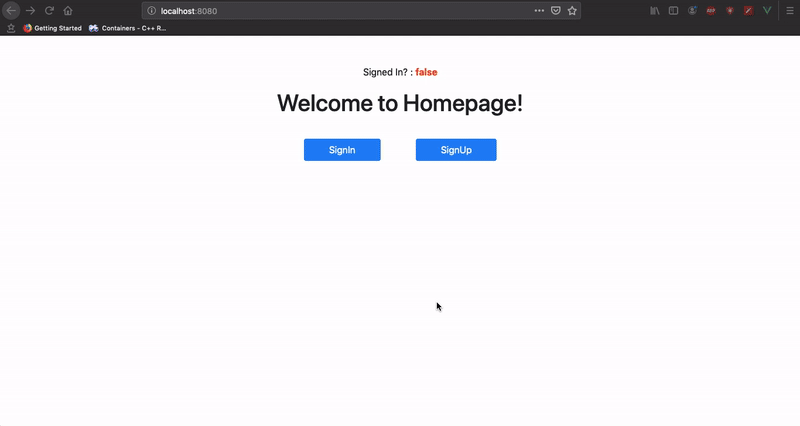

# Rails-Auth-Backend &nbsp; [](https://github.com/manojnaidu619/vue-authentication)

* ```/users``` endpoint is to create users (Signup)
* ```/tokens``` endpoint is to sign users in and issue jwt (Signin)


